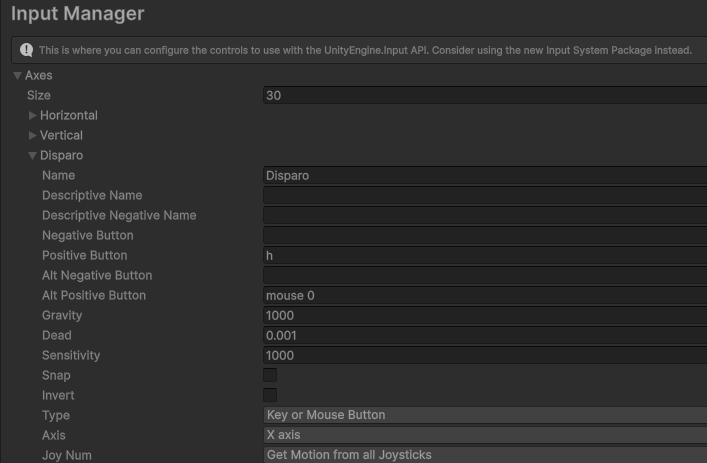
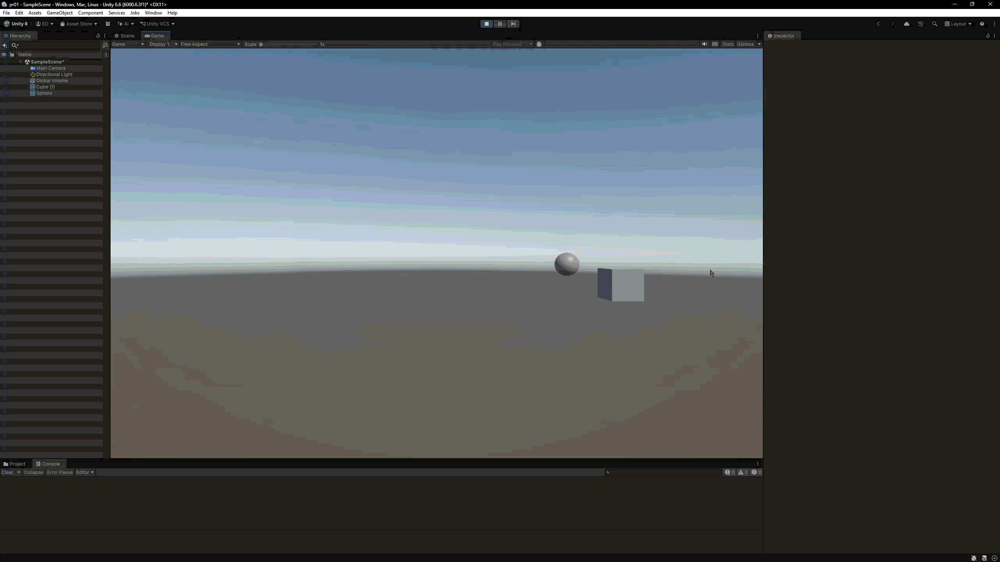
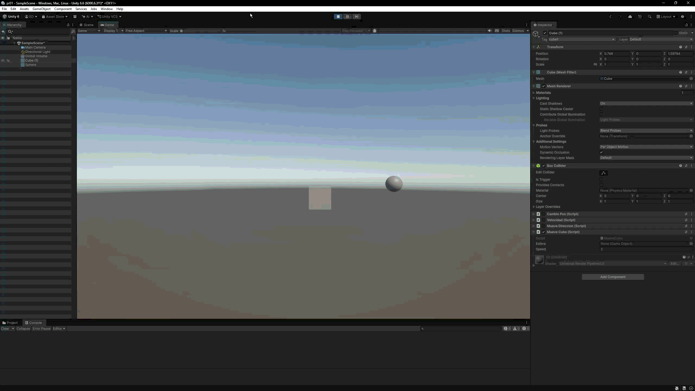
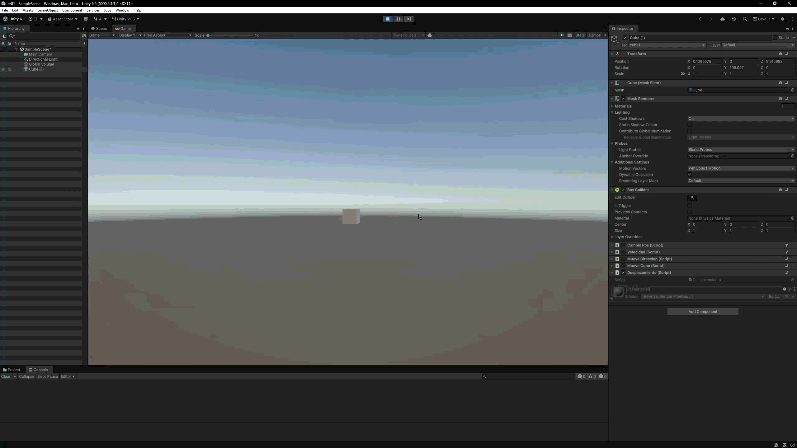

# Práctica 1: Introducción C# - Scripts

Esta práctica contiene varios ejercicios independientes. Cada script se
adjunta a un GameObject de la escena y muestra el resultado en la escena o en
la consola de Unity.

## Índice

1. [Mover tres objetos con la barra espaciadora](#5-mover-tres-objetos-con-la-barra-espaciadora)
2. [Velocidad del cubo](#6-velocidad-del-cubo)
3. [Mapeo de la tecla H](#7-mapeo-de-la-tecla-h)
4. [Movimiento en una dirección](#8-movimiento-en-una-dirección)
5. [Movimiento del cubo y la esfera](#9-y-10-movimiento-del-cubo-y-la-esfera)
6. [Cubo hacia la esfera](#11-cubo-hacia-la-esfera)
7. [Cubo orientado hacia la esfera](#12-cubo-orientado-hacia-la-esfera)
8. [Movimiento hacia adelante](#13-movimiento-hacia-adelante)

## Ejercicios

### 5. Mover tres objetos con la barra espaciadora

Archivos: [Encontrar3objetos.cs](ejercicio5/Encontrar3objetos.cs) y
[CambioPos.cs](ejercicio5/CambioPos.cs)

Cada uno de los tres objetos tiene un desplazamiento `Vector3` configurable
desde el inspector. Al pulsar la barra espaciadora, el script utiliza
`Input.GetAxis("Jump")` para ubicar los objetos en sus nuevas posiciones,
sumando el desplazamiento a la posición original.

[Volver al índice](#índice)

### 6. Velocidad del cubo

Archivo: [Velocidad.cs](ejercicio6/Velocidad.cs)

El cubo tiene una velocidad configurable desde el inspector. Cuando se pulsa
una tecla de flecha, el script obtiene los valores de los ejes `Horizontal` y
`Vertical` y muestra en la consola el resultado de multiplicarlos por la
velocidad. Cada mensaje comienza con el nombre de la flecha pulsada.

[Volver al índice](#índice)

### 7. Mapeo de la tecla H

Configuración del Input Manager, sin script asociado.

La tecla `H` se asigna a la función `disparo` mediante el Input Manager de
Unity, utilizando el sistema de entrada antiguo.

[Volver al índice](#índice)

### 8. Movimiento en una dirección

Archivo: [MueveDireccion.cs](ejercicio8/MueveDireccion.cs)

El cubo se traslada en cada iteración según el vector `moveDirection` y la
velocidad `speed`, ambos configurables desde el inspector. El desplazamiento se
escala con `Time.deltaTime` para que sea proporcional al tiempo transcurrido.

[Volver al índice](#índice)

### 9 y 10. Movimiento del cubo y la esfera

Archivo: [MueveCubo.cs](ejercicio9-10/MueveCubo.cs)

El cubo se mueve con las teclas de flecha a la velocidad `speed`. El
desplazamiento horizontal y vertical se aplica utilizando `Translate` y se
escala con `Time.deltaTime` para que el movimiento sea independiente de la
frecuencia de generación de frames.

[Volver al índice](#índice)

### 11. Cubo hacia la esfera

Archivo: [MueveCubo.cs](ejercicio11/MueveCubo.cs)

El cubo avanza hacia la esfera al pulsar las teclas de flecha. La dirección se
calcula mediante el vector que une ambos objetos, se normaliza y se mantiene
la altura del cubo. De este modo, la distancia a la esfera no modifica la
velocidad de avance.

[Volver al índice](#índice)

### 12. Cubo orientado hacia la esfera

Archivo: [MueveCubo.cs](ejercicio12/MueveCubo.cs)

El cubo adapta el ejercicio anterior para mirar siempre hacia la esfera.
`Transform.LookAt` orienta el eje Z positivo hacia el objetivo y el cubo avanza
en esa dirección con `Vector3.forward`. La esfera puede moverse con las teclas
`W`, `A`, `S` y `D`.

[Volver al índice](#índice)

### 13. Movimiento hacia adelante

Archivo: [Desplazamiento.cs](ejercicio13/Desplazamiento.cs)

El objeto utiliza el eje `Horizontal` para girar sobre el eje Y y avanza siempre
en la dirección de su eje Z positivo mediante `transform.forward`. La velocidad
de giro y el desplazamiento se escalan con `Time.deltaTime`. También se dibuja
un rayo azul para visualizar la dirección del movimiento.

[Volver al índice](#índice)
